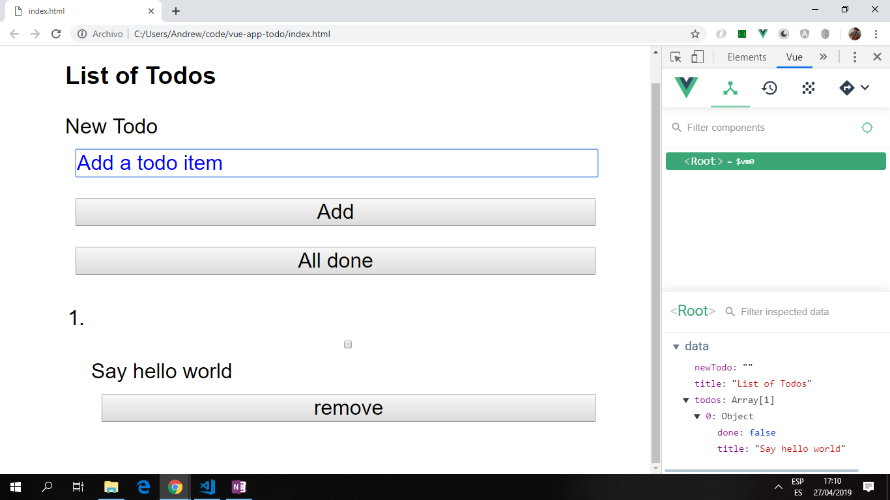

# :zap: Vue App Todo

- Vue app to display todo items with a checkbox to show item is done and a button to remove the todo item from the list.

**Note:** to open web links in a new window use: _ctrl+click on link_

## :page_facing_up: Table of contents

- [:zap: Vue App Todo](#zap-vue-app-todo)
  _ [:page_facing_up: Table of contents](#page_facing_up-table-of-contents)
  _ [:books: General info](#books-general-info)
  _ [:camera: Screenshots](#camera-screenshots)
  _ [:signal_strength: Technologies](#signal_strength-technologies)
  _ [:floppy_disk: Setup](#floppy_disk-setup)
  _ [:computer: Code Examples](#computer-code-examples)
  _ [:cool: Features](#cool-features)
  _ [:clipboard: Status & To-Do List](#clipboard-status--to-do-list)
  _ [:clap: Inspiration](#clap-inspiration)
  _ [:envelope: Contact](#envelope-contact)

## :books: General info

- Data displayed using one-way data-binding and v-for loops.

## :camera: Screenshots



## :signal_strength: Technologies

- [Vue framework v2.6.11](https://vuejs.org/) used by adding the vue script to the body of the index.html page.
- [Vue DevTools extension for Chrome](https://chrome.google.com/webstore/detail/vuejs-devtools/nhdogjmejiglipccpnnnanhbledajbpd).
- [Code Garden ready-made css library](https://ez-css.now.sh/) used for basic styling.

## :floppy_disk: Setup

- Open `index.html`. This is just a html page so it will not automatically reload if you change any of the source files.

## :computer: Code Examples

- App.js file: including data array and methods to add and remove todos

```javascript
const app = new Vue({
	el: '#app',
	data: {
		title: 'hello',
		newTodo: '',
		todos: [],
	},
	methods: {
		addTodo() {
			console.log('form submitted');
			this.todos.push({
				title: this.newTodo,
				done: false,
			});
			this.newTodo = ''; /*clear input box*/
		},
		removeTodo(todo) {
			const todoIndex = this.todos.indexOf(todo);
			this.todos.splice(todoIndex, 1);
		},
		allDone() {
			this.todos.forEach((todo) => {
				todo.done = true;
			});
		},
	},
});
```

## :cool: Features

- Minimal amount of code, no dependencies to update.

## :clipboard: Status & To-Do List

- Status: Simple working app with basic UI.
- To-Do: add functionality - change todo checkbox to a proper button with 'todoDone()' function.

## :clap: Inspiration

- [Youtube: Coding Garden: Intro to Vue.js: Build a Todo App](https://www.youtube.com/watch?v=-X2hP9pOVss&t=553s)

## :envelope: Contact

- Repo created by [ABateman](https://www.andrewbateman.org) - you are welcome to [send me a message](https://andrewbateman.org/contact)
